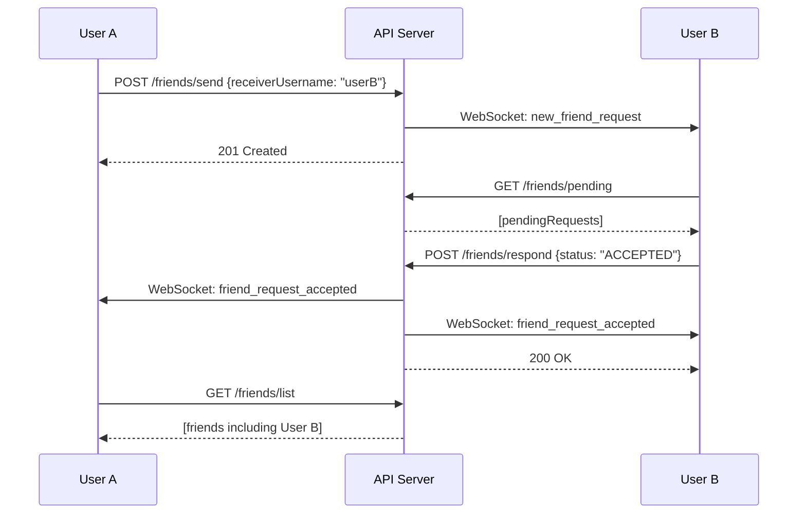

## Overview

The Friends API allows users to send friend requests, view pending requests, accept or reject them, and retrieve their friends list. All endpoints require authentication via the `x-user-id` header.

## Authentication

All friend endpoints require authentication:

```bash
X-User-Id: <user_id>
```

---

## Send Friend Request

<Card title="POST /api/friends/send" icon="paper-plane">
  Send a friend request to another user by their username. Real-time notifications are sent via WebSocket.
</Card>

### Request

<ParamField body="receiverUsername" type="string" required>
  The username of the user to send a friend request to.
</ParamField>

### Response

<ResponseField name="id" type="number">
  Unique friend request ID
</ResponseField>

<ResponseField name="senderId" type="number">
  ID of the user who sent the request
</ResponseField>

<ResponseField name="receiverId" type="number">
  ID of the user receiving the request
</ResponseField>

<ResponseField name="status" type="string">
  Request status (always "PENDING" on creation)
</ResponseField>

<ResponseField name="sender" type="object">
  Sender's public profile
  <Expandable title="properties">
    <ResponseField name="id" type="number">
      Sender's user ID
    </ResponseField>
    <ResponseField name="username" type="string">
      Sender's username
    </ResponseField>
    <ResponseField name="avatar" type="string | null">
      Sender's avatar URL
    </ResponseField>
  </Expandable>
</ResponseField>

<ResponseField name="receiver" type="object">
  Receiver's public profile (same structure as sender)
</ResponseField>

### Code Example

<CodeGroup>
```bash cURL
curl -X POST https://api.opschat.com/api/friends/send \
  -H "Content-Type: application/json" \
  -H "X-User-Id: 123" \
  -d '{
    "receiverUsername": "jane_doe"
  }'
```

```javascript JavaScript
const response = await fetch('https://api.opschat.com/api/friends/send', {
  method: 'POST',
  headers: {
    'Content-Type': 'application/json',
    'X-User-Id': '123'
  },
  body: JSON.stringify({
    receiverUsername: 'jane_doe'
  })
});

const request = await response.json();
console.log(`Request sent to ${request.receiver.username}`);
```

```python Python
import requests

response = requests.post(
    'https://api.opschat.com/api/friends/send',
    headers={'X-User-Id': '123'},
    json={'receiverUsername': 'jane_doe'}
)

request_data = response.json()
print(f"Request ID: {request_data['id']}")
```
</CodeGroup>

### Real-time Event

When a friend request is sent, the receiver gets a WebSocket event:

```javascript
socket.on('new_friend_request', (request) => {
  console.log(`New friend request from ${request.sender.username}`);
  // Update UI to show notification
});
```

### Error Responses

<Expandable title="404 - User Not Found">
  ```json
  {
    "error": "User not found"
  }
  ```
</Expandable>

<Expandable title="400 - Cannot Send to Self">
  ```json
  {
    "error": "You cannot send a request to yourself"
  }
  ```
</Expandable>

<Expandable title="400 - Request Already Exists">
  ```json
  {
    "error": "Request already exists or you are already friends"
  }
  ```
</Expandable>

---

## Get Pending Requests

<Card title="GET /api/friends/pending" icon="clock">
  Retrieve all pending friend requests received by the authenticated user.
</Card>

### Response

Returns an array of pending friend request objects:

<ResponseField name="id" type="number">
  Request ID
</ResponseField>

<ResponseField name="senderId" type="number">
  ID of the user who sent the request
</ResponseField>

<ResponseField name="receiverId" type="number">
  ID of the authenticated user
</ResponseField>

<ResponseField name="status" type="string">
  Always "PENDING" for this endpoint
</ResponseField>

<ResponseField name="sender" type="object">
  Sender's public profile
  <Expandable title="properties">
    <ResponseField name="id" type="number" />
    <ResponseField name="username" type="string" />
    <ResponseField name="avatar" type="string | null" />
  </Expandable>
</ResponseField>

<ResponseField name="createdAt" type="string">
  ISO 8601 timestamp of when the request was sent
</ResponseField>

### Code Example

<CodeGroup>
```bash cURL
curl https://api.opschat.com/api/friends/pending \
  -H "X-User-Id: 456"
```

```javascript JavaScript
const response = await fetch('https://api.opschat.com/api/friends/pending', {
  headers: { 'X-User-Id': '456' }
});

const pendingRequests = await response.json();
pendingRequests.forEach(request => {
  console.log(`${request.sender.username} wants to be friends`);
});
```

```python Python
import requests

response = requests.get(
    'https://api.opschat.com/api/friends/pending',
    headers={'X-User-Id': '456'}
)

pending = response.json()
print(f"You have {len(pending)} pending requests")
```
</CodeGroup>

---

## Respond to Friend Request

<Card title="POST /api/friends/respond" icon="check">
  Accept or reject a friend request. Accepting triggers real-time notifications to both users.
</Card>

### Request

<ParamField body="requestId" type="number" required>
  The ID of the friend request to respond to.
</ParamField>

<ParamField body="status" type="string" required>
  Response action: `"ACCEPTED"` or `"REJECTED"`
</ParamField>

### Response (Accept)

<ResponseField name="id" type="number">
  Request ID
</ResponseField>

<ResponseField name="status" type="string">
  Updated status: "ACCEPTED"
</ResponseField>

<ResponseField name="senderId" type="number">
  Original sender's ID
</ResponseField>

<ResponseField name="receiverId" type="number">
  Receiver's ID (authenticated user)
</ResponseField>

### Response (Reject)

<ResponseField name="message" type="string">
  Confirmation message: "Request rejected"
</ResponseField>

### Code Example

<CodeGroup>
```bash cURL - Accept
curl -X POST https://api.opschat.com/api/friends/respond \
  -H "Content-Type: application/json" \
  -H "X-User-Id: 456" \
  -d '{
    "requestId": 89,
    "status": "ACCEPTED"
  }'
```

```bash cURL - Reject
curl -X POST https://api.opschat.com/api/friends/respond \
  -H "Content-Type: application/json" \
  -H "X-User-Id: 456" \
  -d '{
    "requestId": 89,
    "status": "REJECTED"
  }'
```

```javascript JavaScript
// Accept request
const acceptResponse = await fetch('https://api.opschat.com/api/friends/respond', {
  method: 'POST',
  headers: {
    'Content-Type': 'application/json',
    'X-User-Id': '456'
  },
  body: JSON.stringify({
    requestId: 89,
    status: 'ACCEPTED'
  })
});

const result = await acceptResponse.json();
console.log('You are now friends!');
```
</CodeGroup>

### Real-time Events

When a request is accepted, both users receive WebSocket notifications:

```javascript
socket.on('friend_request_accepted', ({ friend, requestId }) => {
  console.log(`${friend.username} is now your friend!`);
  // Update friends list in UI
});
```

### Error Responses

<Expandable title="404 - Request Not Found">
  ```json
  {
    "error": "Request not found or unauthorized"
  }
  ```
  
  This occurs when:
  - The request ID doesn't exist
  - The authenticated user is not the receiver of the request
</Expandable>

<Note>
  Rejected requests are permanently deleted from the database. Users can send new requests after rejection.
</Note>

---

## Get Friends List

<Card title="GET /api/friends/list" icon="users">
  Retrieve all accepted friends for the authenticated user.
</Card>

### Response

Returns an array of friend user objects:

<ResponseField name="id" type="number">
  Friend's user ID
</ResponseField>

<ResponseField name="username" type="string">
  Friend's username
</ResponseField>

<ResponseField name="name" type="string | null">
  Friend's display name
</ResponseField>

<ResponseField name="status" type="string | null">
  Friend's custom status message
</ResponseField>

<ResponseField name="avatar" type="string | null">
  Friend's avatar URL
</ResponseField>

### Code Example

<CodeGroup>
```bash cURL
curl https://api.opschat.com/api/friends/list \
  -H "X-User-Id: 123"
```

```javascript JavaScript
const response = await fetch('https://api.opschat.com/api/friends/list', {
  headers: { 'X-User-Id': '123' }
});

const friends = await response.json();
console.log(`You have ${friends.length} friends`);

friends.forEach(friend => {
  console.log(`- ${friend.name || friend.username}`);
  if (friend.status) {
    console.log(`  Status: ${friend.status}`);
  }
});
```

```python Python
import requests

response = requests.get(
    'https://api.opschat.com/api/friends/list',
    headers={'X-User-Id': '123'}
)

friends = response.json()
for friend in friends:
    print(f"{friend['username']} - {friend.get('status', 'No status')}")
```
</CodeGroup>

### Response Example

```json
[
  {
    "id": 456,
    "username": "jane_doe",
    "name": "Jane Doe",
    "status": "Building cool stuff",
    "avatar": "https://storage.opschat.com/avatars/456.jpg"
  },
  {
    "id": 789,
    "username": "bob_smith",
    "name": "Bob Smith",
    "status": null,
    "avatar": null
  }
]
```

---

## Friend Request Workflow

Here's the complete flow for managing friend requests:



<Tip>
  Use WebSocket listeners to provide real-time updates when friend requests are sent or accepted, creating a more responsive user experience.
</Tip>
