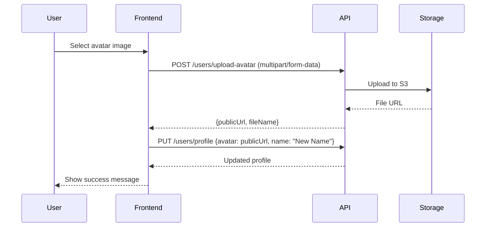

## Overview

The Users API allows authenticated users to view and update their profiles, upload avatars, and retrieve public information about other users. All endpoints require authentication.

## Authentication

All user endpoints require the `x-user-id` header:

```bash
X-User-Id: <user_id>
```

---

## Get Current User Profile

<Card title="GET /api/users/profile" icon="id-card">
  Retrieve the authenticated user's complete profile information.
</Card>

### Response

<ResponseField name="id" type="number">
  User's unique identifier
</ResponseField>

<ResponseField name="username" type="string">
  Unique username
</ResponseField>

<ResponseField name="email" type="string">
  User's email address (only visible in own profile)
</ResponseField>

<ResponseField name="name" type="string | null">
  Display name
</ResponseField>

<ResponseField name="status" type="string | null">
  Custom status message (max 60 characters)
</ResponseField>

<ResponseField name="bio" type="string | null">
  User biography (max 500 characters)
</ResponseField>

<ResponseField name="avatar" type="string | null">
  Avatar image URL
</ResponseField>

<ResponseField name="avatarColor" type="string | null">
  Hex color code for avatar background
</ResponseField>

<ResponseField name="createdAt" type="string">
  ISO 8601 timestamp of account creation
</ResponseField>

### Code Example

<CodeGroup>
```bash cURL
curl https://api.opschat.com/api/users/profile \
  -H "X-User-Id: 123"
```

```javascript JavaScript
const response = await fetch('https://api.opschat.com/api/users/profile', {
  headers: { 'X-User-Id': '123' }
});

const profile = await response.json();
console.log(`Welcome, ${profile.name || profile.username}!`);
console.log(`Member since: ${new Date(profile.createdAt).toLocaleDateString()}`);
```

```python Python
import requests

response = requests.get(
    'https://api.opschat.com/api/users/profile',
    headers={'X-User-Id': '123'}
)

profile = response.json()
print(f"Username: {profile['username']}")
print(f"Email: {profile['email']}")
```
</CodeGroup>

### Response Example

```json
{
  "id": 123,
  "username": "john_dev",
  "email": "john@example.com",
  "name": "John Developer",
  "status": "Building awesome things",
  "bio": "Full-stack developer passionate about open source.",
  "avatar": "https://storage.opschat.com/avatars/123-uuid.jpg",
  "avatarColor": "#3B82F6",
  "createdAt": "2024-01-15T10:30:00.000Z"
}
```

---

## Update User Profile

<Card title="PUT /api/users/profile" icon="pen-to-square">
  Update the authenticated user's profile information. All fields are optional.
</Card>

### Request

<ParamField body="name" type="string" optional>
  Display name for the user
</ParamField>

<ParamField body="status" type="string" optional>
  Custom status message (max 60 characters)
</ParamField>

<ParamField body="bio" type="string" optional>
  User biography (max 500 characters)
</ParamField>

<ParamField body="avatar" type="string" optional>
  Avatar image URL (use upload endpoint to get URL)
</ParamField>

<ParamField body="avatarColor" type="string" optional>
  Hex color code for avatar background (e.g., "#3B82F6")
</ParamField>

### Response

Returns the updated user profile (excludes email and createdAt):

<ResponseField name="id" type="number">
  User ID
</ResponseField>

<ResponseField name="username" type="string">
  Username (cannot be changed)
</ResponseField>

<ResponseField name="name" type="string | null">
  Updated display name
</ResponseField>

<ResponseField name="status" type="string | null">
  Updated status
</ResponseField>

<ResponseField name="bio" type="string | null">
  Updated bio
</ResponseField>

<ResponseField name="avatar" type="string | null">
  Updated avatar URL
</ResponseField>

<ResponseField name="avatarColor" type="string | null">
  Updated avatar color
</ResponseField>

### Code Example

<CodeGroup>
```bash cURL
curl -X PUT https://api.opschat.com/api/users/profile \
  -H "Content-Type: application/json" \
  -H "X-User-Id: 123" \
  -d '{
    "name": "John Developer",
    "status": "On vacation",
    "bio": "Full-stack developer specializing in React and Node.js",
    "avatarColor": "#10B981"
  }'
```

```javascript JavaScript
const response = await fetch('https://api.opschat.com/api/users/profile', {
  method: 'PUT',
  headers: {
    'Content-Type': 'application/json',
    'X-User-Id': '123'
  },
  body: JSON.stringify({
    name: 'John Developer',
    status: 'On vacation',
    bio: 'Full-stack developer specializing in React and Node.js',
    avatarColor: '#10B981'
  })
});

const updated = await response.json();
console.log('Profile updated:', updated);
```

```python Python
import requests

response = requests.put(
    'https://api.opschat.com/api/users/profile',
    headers={'X-User-Id': '123'},
    json={
        'name': 'John Developer',
        'status': 'On vacation',
        'bio': 'Full-stack developer specializing in React and Node.js',
        'avatarColor': '#10B981'
    }
)

updated_profile = response.json()
print(f"New status: {updated_profile['status']}")
```
</CodeGroup>

### Error Responses

<Expandable title="400 - Status Too Long">
  ```json
  {
    "error": "Status must be less than 60 characters"
  }
  ```
</Expandable>

<Expandable title="400 - Bio Too Long">
  ```json
  {
    "error": "Bio must be less than 500 characters"
  }
  ```
</Expandable>

---

## Upload Avatar

<Card title="POST /api/users/upload-avatar" icon="image">
  Upload a new avatar image. Only image files up to 5MB are allowed.
</Card>

### Request

<ParamField body="avatar" type="file" required>
  Image file (JPEG, PNG, GIF, WebP). Max size: 5MB.
</ParamField>

<Note>
  This endpoint expects `multipart/form-data` encoding with the file uploaded as the `avatar` field.
</Note>

### Response

<ResponseField name="publicUrl" type="string">
  Full URL to the uploaded avatar image
</ResponseField>

<ResponseField name="fileName" type="string">
  Internal file name in storage (e.g., "avatars/123-uuid.jpg")
</ResponseField>

### Code Example

<CodeGroup>
```bash cURL
curl -X POST https://api.opschat.com/api/users/upload-avatar \
  -H "X-User-Id: 123" \
  -F "avatar=@/path/to/profile-pic.jpg"
```

```javascript JavaScript
const fileInput = document.querySelector('input[type="file"]');
const file = fileInput.files[0];

const formData = new FormData();
formData.append('avatar', file);

const response = await fetch('https://api.opschat.com/api/users/upload-avatar', {
  method: 'POST',
  headers: { 'X-User-Id': '123' },
  body: formData
});

const { publicUrl } = await response.json();

// Now update profile with the new avatar URL
await fetch('https://api.opschat.com/api/users/profile', {
  method: 'PUT',
  headers: {
    'Content-Type': 'application/json',
    'X-User-Id': '123'
  },
  body: JSON.stringify({ avatar: publicUrl })
});
```

```python Python
import requests

# Upload avatar
with open('/path/to/profile-pic.jpg', 'rb') as f:
    response = requests.post(
        'https://api.opschat.com/api/users/upload-avatar',
        headers={'X-User-Id': '123'},
        files={'avatar': f}
    )

upload_result = response.json()
public_url = upload_result['publicUrl']

# Update profile with new avatar
requests.put(
    'https://api.opschat.com/api/users/profile',
    headers={'X-User-Id': '123'},
    json={'avatar': public_url}
)
```
</CodeGroup>

### Response Example

```json
{
  "publicUrl": "https://storage.opschat.com/opschat/avatars/123-550e8400-e29b-41d4-a716-446655440000.jpg",
  "fileName": "avatars/123-550e8400-e29b-41d4-a716-446655440000.jpg"
}
```

### Error Responses

<Expandable title="400 - No File Uploaded">
  ```json
  {
    "error": "No file uploaded"
  }
  ```
</Expandable>

<Expandable title="400 - Invalid File Type">
  ```json
  {
    "error": "Only image files are allowed"
  }
  ```
</Expandable>

<Expandable title="413 - File Too Large">
  ```json
  {
    "error": "File size exceeds 5MB limit"
  }
  ```
</Expandable>

<Warning>
  After uploading an avatar, you must call the `PUT /api/users/profile` endpoint to associate the avatar URL with your profile.
</Warning>

---

## Get User by ID

<Card title="GET /api/users/:userId" icon="magnifying-glass">
  Retrieve public profile information for any user by their ID.
</Card>

### Path Parameters

<ParamField path="userId" type="number" required>
  The ID of the user to retrieve
</ParamField>

### Response

Returns public user information (excludes email and createdAt):

<ResponseField name="id" type="number">
  User's unique identifier
</ResponseField>

<ResponseField name="username" type="string">
  Username
</ResponseField>

<ResponseField name="name" type="string | null">
  Display name
</ResponseField>

<ResponseField name="status" type="string | null">
  Custom status message
</ResponseField>

<ResponseField name="bio" type="string | null">
  User biography
</ResponseField>

<ResponseField name="avatar" type="string | null">
  Avatar URL
</ResponseField>

<ResponseField name="avatarColor" type="string | null">
  Avatar background color
</ResponseField>

### Code Example

<CodeGroup>
```bash cURL
curl https://api.opschat.com/api/users/456 \
  -H "X-User-Id: 123"
```

```javascript JavaScript
const response = await fetch('https://api.opschat.com/api/users/456', {
  headers: { 'X-User-Id': '123' }
});

const user = await response.json();
console.log(`${user.name || user.username}`);
console.log(`Bio: ${user.bio || 'No bio'}`);
```

```python Python
import requests

response = requests.get(
    'https://api.opschat.com/api/users/456',
    headers={'X-User-Id': '123'}
)

user = response.json()
print(f"Username: {user['username']}")
print(f"Status: {user.get('status', 'No status')}")
```
</CodeGroup>

### Response Example

```json
{
  "id": 456,
  "username": "jane_designer",
  "name": "Jane Designer",
  "status": "Creating beautiful UIs",
  "bio": "Product designer with 8 years of experience in UX/UI.",
  "avatar": "https://storage.opschat.com/avatars/456.jpg",
  "avatarColor": "#EC4899"
}
```

### Error Responses

<Expandable title="404 - User Not Found">
  ```json
  {
    "error": "User not found"
  }
  ```
</Expandable>

<Info>
  This endpoint returns only public profile information. Email addresses and account creation dates are never exposed through this endpoint.
</Info>

---

## Profile Update Workflow

Here's a typical workflow for updating a user profile with a new avatar:



<Tip>
  To provide a better user experience, show a preview of the uploaded avatar before calling the profile update endpoint. This allows users to confirm their selection before saving.
</Tip>
