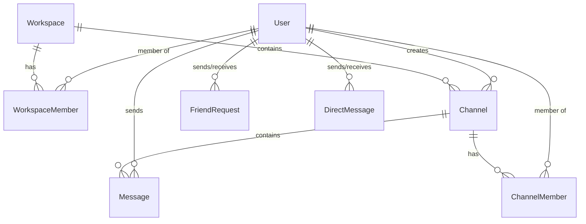

## Overview

OpsChat uses **PostgreSQL** as its primary database with **Prisma** as the ORM. The schema is defined in `opschat-backend/prisma/schema.prisma`.

<Info>
  All timestamps use UTC, and the database handles automatic creation timestamps via `@default(now())`
</Info>

## Schema Configuration

```prisma
generator client {
  provider = "prisma-client-js"
  binaryTargets = ["native", "linux-musl-openssl-3.0.x"]
}

datasource db {
  provider = "postgresql"
  url      = env("DATABASE_URL")
}
```

The `binaryTargets` includes `linux-musl-openssl-3.0.x` for Docker/Alpine Linux compatibility.

## Core Models

### User Model

Stores all user account information and profile data.

```prisma
model User {
  id               Int             @id @default(autoincrement())
  email            String          @unique
  password         String
  username         String?         @unique
  name             String?
  avatar           String?
  avatarColor      String?
  status           String?         // Short 1-line info (e.g. "DevOps Engineer")
  bio              String?         // Longer bio up to 500 chars
  createdAt        DateTime        @default(now())

  messages            Message[]
  workspaceMembers    WorkspaceMember[]
  createdChannels     Channel[]         @relation("CreatedChannels")
  channelMemberships  ChannelMember[]
  
  sentRequests     FriendRequest[] @relation("SentRequests")
  receivedRequests FriendRequest[] @relation("ReceivedRequests")
  
  sentDMs          DirectMessage[] @relation("SentDMs")
  receivedDMs      DirectMessage[] @relation("ReceivedDMs")
}
```

<AccordionGroup>
  <Accordion title="Field Descriptions">
    | Field | Type | Description |
    |-------|------|-------------|
    | `id` | Int | Auto-incrementing primary key |
    | `email` | String | Unique email address (required for login) |
    | `password` | String | Bcrypt hashed password |
    | `username` | String? | Optional unique username |
    | `name` | String? | Display name |
    | `avatar` | String? | URL to avatar image in MinIO |
    | `avatarColor` | String? | Fallback color for avatar (hex code) |
    | `status` | String? | Short status line (e.g., "DevOps Engineer") |
    | `bio` | String? | Longer biography (up to 500 characters) |
    | `createdAt` | DateTime | Account creation timestamp |
  </Accordion>

  <Accordion title="Relationships">
    - **messages**: All messages sent by this user
    - **workspaceMembers**: Workspace memberships
    - **createdChannels**: Channels created by this user
    - **channelMemberships**: Channels the user is a member of
    - **sentRequests** / **receivedRequests**: Friend requests
    - **sentDMs** / **receivedDMs**: Direct messages
  </Accordion>
</AccordionGroup>

### Workspace Model

Organizational containers for channels and teams.

```prisma
model Workspace {
  id        Int               @id @default(autoincrement())
  name      String
  slug      String            @unique
  ownerId   Int
  createdAt DateTime          @default(now())

  channels  Channel[]
  members   WorkspaceMember[]
}
```

<CardGroup cols={2}>
  <Card title="Fields" icon="table">
    - `id`: Primary key
    - `name`: Display name
    - `slug`: Unique URL-friendly identifier
    - `ownerId`: User who owns the workspace
    - `createdAt`: Creation timestamp
  </Card>
  <Card title="Example" icon="code">
    ```json
    {
      "id": 1,
      "name": "Default Workspace",
      "slug": "default",
      "ownerId": 1
    }
    ```
  </Card>
</CardGroup>

### WorkspaceMember Model

Junction table linking users to workspaces with roles.

```prisma
model WorkspaceMember {
  id          Int       @id @default(autoincrement())
  userId      Int
  workspaceId Int
  role        String    @default("MEMBER")
  joinedAt    DateTime  @default(now())

  user        User      @relation(fields: [userId], references: [id])
  workspace   Workspace @relation(fields: [workspaceId], references: [id])

  @@unique([userId, workspaceId])
}
```

<Note>
  The `@@unique([userId, workspaceId])` constraint ensures a user can only be a member of each workspace once.
</Note>

**Available Roles:**
- `ADMIN` - Full workspace control
- `MEMBER` - Standard access

### Channel Model

Conversation channels within workspaces.

```prisma
model Channel {
  id          Int             @id @default(autoincrement())
  name        String
  workspaceId Int
  creatorId   Int
  inviteCode  String          @unique @default(uuid())
  createdAt   DateTime        @default(now())

  workspace   Workspace       @relation(fields: [workspaceId], references: [id])
  creator     User            @relation("CreatedChannels", fields: [creatorId], references: [id])
  messages    Message[]
  members     ChannelMember[]

  @@unique([workspaceId, name])
}
```

<Tip>
  Each channel has a unique `inviteCode` (UUID) for sharing invitation links.
</Tip>

### ChannelMember Model

Manages user membership in channels.

```prisma
model ChannelMember {
  id        Int      @id @default(autoincrement())
  userId    Int
  channelId Int
  role      String   @default("MEMBER") // CREATOR, ADMIN, MEMBER
  joinedAt  DateTime @default(now())

  user      User     @relation(fields: [userId], references: [id])
  channel   Channel  @relation(fields: [channelId], references: [id], onDelete: Cascade)

  @@unique([userId, channelId])
}
```

**Available Roles:**
- `CREATOR` - Channel creator
- `ADMIN` - Channel administrator
- `MEMBER` - Standard member

<Warning>
  Deleting a channel cascades to all `ChannelMember` records (`onDelete: Cascade`).
</Warning>

### Message Model

Channel messages with support for different content types.

```prisma
model Message {
  id        Int       @id @default(autoincrement())
  content   String
  author    String
  userId    Int?
  type      String    @default("text")
  channelId Int
  expiresAt DateTime?
  createdAt DateTime  @default(now())

  channel   Channel   @relation(fields: [channelId], references: [id], onDelete: Cascade)
  user      User?     @relation(fields: [userId], references: [id])
}
```

**Message Types:**
- `text` - Plain text message
- `image` - Image upload
- `voice` - Voice note
- `file` - File attachment

<Info>
  The `expiresAt` field enables temporary/ephemeral messages.
</Info>

### DirectMessage Model

One-on-one private messages between users.

```prisma
model DirectMessage {
  id         Int      @id @default(autoincrement())
  content    String
  type       String   @default("text")
  senderId   Int
  receiverId Int
  createdAt  DateTime @default(now())

  sender     User     @relation("SentDMs", fields: [senderId], references: [id])
  receiver   User     @relation("ReceivedDMs", fields: [receiverId], references: [id])
}
```

### FriendRequest Model

Manages friend connections between users.

```prisma
model FriendRequest {
  id         Int      @id @default(autoincrement())
  senderId   Int
  receiverId Int
  status     String   @default("PENDING") 
  createdAt  DateTime @default(now())

  sender     User     @relation("SentRequests", fields: [senderId], references: [id])
  receiver   User     @relation("ReceivedRequests", fields: [receiverId], references: [id])

  @@unique([senderId, receiverId])
}
```

**Status Values:**
- `PENDING` - Awaiting response
- `ACCEPTED` - Friends connected
- `REJECTED` - Request declined

## Relationship Diagram



## Common Queries

### Get User with Workspaces

```javascript
const user = await prisma.user.findUnique({
  where: { email: 'user@example.com' },
  include: {
    workspaceMembers: {
      include: {
        workspace: true
      }
    }
  }
});
```

### Get Channel with Messages

```javascript
const channel = await prisma.channel.findUnique({
  where: { id: channelId },
  include: {
    messages: {
      orderBy: { createdAt: 'desc' },
      take: 50,
      include: {
        user: {
          select: {
            id: true,
            name: true,
            avatar: true
          }
        }
      }
    }
  }
});
```

### Get Direct Messages Between Users

```javascript
const dms = await prisma.directMessage.findMany({
  where: {
    OR: [
      { senderId: user1Id, receiverId: user2Id },
      { senderId: user2Id, receiverId: user1Id }
    ]
  },
  orderBy: { createdAt: 'asc' },
  include: {
    sender: {
      select: { id: true, name: true, avatar: true }
    }
  }
});
```

## Database Seeding

The seed script (`prisma/seed.js`) creates:

<Steps>
  <Step title="Admin User">
    ```javascript
    {
      email: 'admin@opschat.io',
      username: 'admin',
      password: 'password123' // bcrypt hashed
    }
    ```
  </Step>

  <Step title="Default Workspace">
    ```javascript
    {
      name: 'Default Workspace',
      slug: 'default',
      ownerId: admin.id
    }
    ```
  </Step>

  <Step title="General Channel">
    ```javascript
    {
      name: 'general',
      workspaceId: workspace.id
    }
    ```
  </Step>
</Steps>

## Migration Commands

<CodeGroup>
```bash Development
# Create a new migration
npx prisma migrate dev --name add_new_field

# Apply migrations
npx prisma migrate deploy

# Reset database (WARNING: deletes all data)
npx prisma migrate reset
```

```bash Production
# Apply migrations only
npx prisma migrate deploy

# Generate Prisma Client
npx prisma generate
```

```bash Utilities
# Open Prisma Studio
npx prisma studio

# Validate schema
npx prisma validate

# Format schema file
npx prisma format
```
</CodeGroup>

## Best Practices

<CardGroup cols={2}>
  <Card title="Use Transactions" icon="arrows-rotate">
    For operations affecting multiple tables:
    ```javascript
    await prisma.$transaction(async (tx) => {
      await tx.channel.create({ ... });
      await tx.channelMember.create({ ... });
    });
    ```
  </Card>

  <Card title="Select Only Needed Fields" icon="filter">
    Reduce query size:
    ```javascript
    const user = await prisma.user.findUnique({
      select: { id: true, name: true }
    });
    ```
  </Card>

  <Card title="Use Indexes" icon="gauge-high">
    Add indexes for frequently queried fields in the schema:
    ```prisma
    @@index([channelId, createdAt])
    ```
  </Card>

  <Card title="Handle Cascade Deletes" icon="triangle-exclamation">
    Be aware of `onDelete: Cascade` relationships to prevent data loss.
  </Card>
</CardGroup>