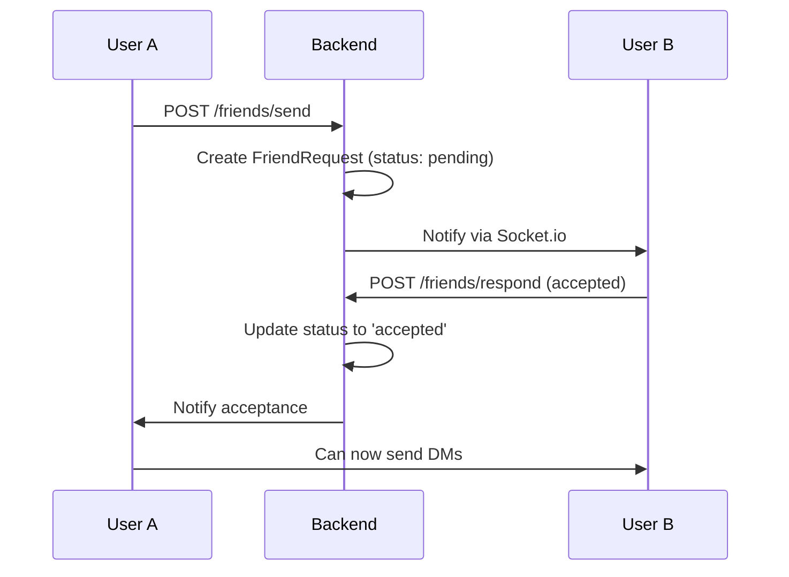

## Overview

OpsChat combines real-time messaging with AI-powered features to create a modern communication platform. Built with WebSocket technology (Socket.io), every feature is designed for instant delivery and seamless user experience.

---

## Core Messaging Features

<CardGroup cols={2}>
  <Card title="Channels" icon="hashtag">
    Create and join public channels for team discussions
  </Card>
  <Card title="Direct Messages" icon="message">
    Private 1-on-1 conversations with end-to-end routing
  </Card>
  <Card title="Real-Time Sync" icon="arrows-rotate">
    Instant message delivery with automatic reconnection
  </Card>
  <Card title="Message History" icon="clock-rotate-left">
    Persistent storage with last 50 messages auto-loaded
  </Card>
</CardGroup>

### Channels

**Public Team Spaces**

Channels are persistent chat rooms where teams can collaborate. Each channel has its own message history and member list.

<Accordion title="Technical Details">
  - Channel messages are stored in PostgreSQL with `channelId` foreign key
  - Socket.io rooms handle real-time broadcasting: `channel_{id}`
  - Last 50 messages auto-load when joining via `load_history` event
  - Messages support text, images, voice notes, and file attachments
  - Optional message expiration with `expiresAt` timestamp
</Accordion>

**Creating a Channel:**

```javascript
POST /api/channels/create
Content-Type: application/json

{
  "name": "engineering",
  "description": "Engineering team discussions"
}
```

**Joining a Channel:**

```javascript
socket.emit('join_channel', {
  channelId: 1,
  userId: 123
});

socket.on('load_history', (messages) => {
  console.log('Last 50 messages:', messages);
});
```

### Direct Messages (DMs)

**Private 1-on-1 Conversations**

Send private messages to friends with the same real-time performance as channels.

<Info>
  **How DMs Work**: Each DM creates a unique room using both user IDs: `dm_{minId}_{maxId}`. This ensures both users always join the same room regardless of who initiated the conversation.
</Info>

**Sending a DM:**

```javascript
socket.emit('send_message', {
  message: 'Hello!',
  author: 'john_doe',
  receiverId: 456,
  userId: 123,
  type: 'text'
});
```

**Backend Implementation:**

```javascript src/socket/handlers.js:119-152
// Save DM to database
const savedDM = await prisma.directMessage.create({
  data: {
    content: message,
    type: type || 'text',
    senderId: parseInt(currentUserId),
    receiverId: parseInt(receiverId)
  },
  include: {
    sender: { select: { username: true, avatar: true } }
  }
});

// Broadcast to both users in DM room
io.to(dmRoom).emit('receive_message', {
  id: savedDM.id.toString(),
  message: message,
  author: savedDM.sender?.username,
  userId: currentUserId,
  receiverId: receiverId,
  time: new Date().toLocaleTimeString()
});
```

### Message History

All messages are persisted in PostgreSQL. When joining a channel or DM, the last 50 messages are automatically loaded.

<CodeGroup>
```javascript Channel History
socket.on('join_channel', async ({ channelId }) => {
  const pastMessages = await prisma.message.findMany({
    where: {
      channelId: channel.id,
      OR: [
        { expiresAt: null },
        { expiresAt: { gt: new Date() } }
      ]
    },
    orderBy: { createdAt: 'asc' },
    take: 50,
    include: { user: true }
  });
  
  socket.emit('load_history', pastMessages);
});
```

```javascript DM History
const dmHistory = await prisma.directMessage.findMany({
  where: {
    OR: [
      { senderId: currentUserId, receiverId: otherUserId },
      { senderId: otherUserId, receiverId: currentUserId }
    ]
  },
  orderBy: { createdAt: 'asc' },
  take: 50
});
```
</CodeGroup>

---

## AI-Powered Features

<CardGroup cols={3}>
  <Card title="Translation" icon="language">
    Translate messages to 50+ languages using Groq LLM
  </Card>
  <Card title="Summarization" icon="file-lines">
    Generate concise summaries of long conversations
  </Card>
  <Card title="Smart Replies" icon="lightbulb">
    AI-suggested contextual responses
  </Card>
</CardGroup>

### AI Translation

**Instant Message Translation**

Translate any message into your preferred language using the Groq API with LLaMA 3.1 model.

<Tip>
  Supports 50+ languages including Spanish, French, German, Japanese, Chinese, Arabic, and more.
</Tip>

**API Endpoint:**

```javascript
POST /api/ai/translate
Content-Type: application/json

{
  "text": "Hello, how are you?",
  "lang": "Spanish"
}

Response:
{
  "translation": "Hola, ¿cómo estás?"
}
```

**Backend Implementation:**

```javascript src/routes/aiRoutes.js:39-66
router.post('/translate', async (req, res) => {
  const { text, lang } = req.body;
  
  const completion = await groq.chat.completions.create({
    messages: [
      {
        role: "system",
        content: `You are a professional translator. Translate the following text into ${lang}. Output ONLY the translated text, no explanations.`
      },
      { role: "user", content: text }
    ],
    model: "llama-3.1-8b-instant",
    temperature: 0.3,
  });
  
  const translation = completion.choices[0]?.message?.content;
  res.json({ translation });
});
```

### Conversation Summarization

**AI-Powered Summaries**

Generate concise 2-3 sentence summaries of long conversations, focusing on key decisions and action items.

**API Endpoint:**

```javascript
POST /api/ai/summarize
Content-Type: application/json

{
  "messages": [
    "Alice: We need to deploy the new feature by Friday",
    "Bob: I'll handle the frontend changes",
    "Alice: Great, I'll do the backend",
    "Bob: Should we write tests first?",
    "Alice: Yes, TDD approach. Let's meet tomorrow."
  ]
}

Response:
{
  "summary": "The team agreed to deploy a new feature by Friday using a TDD approach. Bob will handle frontend changes while Alice works on the backend. They scheduled a meeting for tomorrow to coordinate."
}
```

**Backend Implementation:**

```javascript src/routes/aiRoutes.js:7-36
router.post('/summarize', async (req, res) => {
  const { messages } = req.body;
  const context = messages.join("\n");
  
  const completion = await groq.chat.completions.create({
    messages: [
      {
        role: "system",
        content: "You are a helpful project manager assistant. Summarize the following chat conversation into 2-3 concise sentences. Focus on key decisions and action items."
      },
      { role: "user", content: context }
    ],
    model: "llama-3.3-70b-versatile",
    temperature: 0.5,
  });
  
  res.json({ summary: completion.choices[0]?.message?.content });
});
```

### Smart Reply Suggestions

**Contextual Response Ideas**

Get 3 AI-generated reply suggestions based on recent conversation context.

**API Endpoint:**

```javascript
POST /api/ai/suggest-replies
Content-Type: application/json

{
  "context": [
    "Alice: Can you review my PR?",
    "Bob: Sure, which one?",
    "Alice: PR #142 for the auth feature"
  ]
}

Response:
{
  "suggestions": [
    "I'll check it now",
    "Looking at it",
    "Will review in 10 minutes"
  ]
}
```

<Note>
  Smart replies use the last 5 messages as context to generate relevant, casual but professional suggestions (5-10 words each).
</Note>

---

## File Upload & Storage

**Images & Voice Notes**

Upload and share files using MinIO (S3-compatible) object storage with automatic URL generation.

<CardGroup cols={2}>
  <Card title="Image Uploads" icon="image">
    PNG, JPG, GIF up to 10MB
  </Card>
  <Card title="Voice Notes" icon="microphone">
    WebM, MP3, OGG audio files
  </Card>
  <Card title="S3-Compatible" icon="cloud">
    MinIO storage with presigned URLs
  </Card>
  <Card title="Public Access" icon="globe">
    Direct file access via public URLs
  </Card>
</CardGroup>

### Upload API

```javascript
POST /api/upload
Content-Type: multipart/form-data

FormData:
  file: [binary data]
  userId: 123
  channelId: 1 (optional)
  receiverId: 456 (optional)

Response:
{
  "url": "http://localhost:9000/opschat-uploads/1234567890_image.png",
  "type": "image",
  "messageId": "567"
}
```

**Backend Configuration:**

```javascript src/config/s3.js
const { S3Client } = require('@aws-sdk/client-s3');

const s3Client = new S3Client({
  endpoint: process.env.S3_ENDPOINT || 'http://minio:9000',
  region: 'us-east-1',
  credentials: {
    accessKeyId: process.env.S3_ACCESS_KEY,
    secretAccessKey: process.env.S3_SECRET_KEY,
  },
  forcePathStyle: true,
});
```

<Tip>
  Files are automatically stored in the `opschat-uploads` bucket with public read access.
</Tip>

---

## Friend System

**Build Your Network**

Send and accept friend requests to enable direct messaging.

<Steps>
  <Step title="Send Friend Request">
    ```javascript
    POST /api/friends/send
    {
      "receiverUsername": "alice"
    }
    ```
  </Step>
  
  <Step title="View Pending Requests">
    ```javascript
    GET /api/friends/pending
    
    Response:
    {
      "requests": [
        {
          "id": 1,
          "status": "pending",
          "sender": { "username": "bob", "avatar": "..." }
        }
      ]
    }
    ```
  </Step>
  
  <Step title="Accept or Reject">
    ```javascript
    POST /api/friends/respond
    {
      "requestId": 1,
      "status": "accepted"
    }
    ```
  </Step>
  
  <Step title="View Friends List">
    ```javascript
    GET /api/friends/list
    
    Response:
    {
      "friends": [
        { "id": 2, "username": "alice", "status": "online" }
      ]
    }
    ```
  </Step>
</Steps>

**Friend Request Flow:**



---

## Real-Time Sync & Scaling

### Socket.io with Redis Adapter

OpsChat uses Redis pub/sub to synchronize messages across multiple backend instances, enabling horizontal scaling.

**How It Works:**

<Steps>
  <Step title="User Connects">
    Client establishes WebSocket connection to any backend instance
  </Step>
  <Step title="Message Sent">
    User sends message, backend instance receives it
  </Step>
  <Step title="Redis Pub/Sub">
    Message is published to Redis channel
  </Step>
  <Step title="Broadcast">
    All backend instances receive the message and broadcast to their connected clients
  </Step>
</Steps>

**Configuration:**

```javascript src/server.js:40-49
const io = new Server(server, {
  cors: {
    origin: process.env.CLIENT_URL,
    methods: ["GET", "POST"]
  },
  adapter: createAdapter(pubClient, subClient)
});
```

<Info>
  **Kubernetes Ready**: Deploy multiple backend replicas. Redis adapter ensures all instances stay synchronized.
</Info>

### Health Checks

Built-in health endpoints for monitoring:

```bash
GET /health

Response:
{
  "status": "healthy",
  "timestamp": "2026-03-03T23:15:00.000Z",
  "uptime": 3600,
  "database": "connected",
  "redis": "connected",
  "storage": "connected"
}
```

### Graceful Shutdown

Production-grade shutdown handling:

```javascript src/server.js:105-131
const shutdown = async (signal) => {
  console.log(`Received ${signal}. Shutting down gracefully...`);
  
  server.close(async () => {
    // Close Redis connections
    await pubClient.disconnect();
    await subClient.disconnect();
    
    // Close database connection
    await prisma.$disconnect();
    
    process.exit(0);
  });
};

process.on('SIGTERM', () => shutdown('SIGTERM'));
process.on('SIGINT', () => shutdown('SIGINT'));
```

---

## Authentication & Security

<CardGroup cols={2}>
  <Card title="JWT Tokens" icon="key">
    Stateless authentication with secure tokens
  </Card>
  <Card title="Password Hashing" icon="lock">
    bcrypt with salt rounds for secure storage
  </Card>
  <Card title="CORS Protection" icon="shield">
    Configurable origin whitelist
  </Card>
  <Card title="Auth Middleware" icon="user-shield">
    Protected routes require valid JWT
  </Card>
</CardGroup>

**Login Flow:**

```javascript
POST /api/auth/login
Content-Type: application/json

{
  "username": "alice",
  "password": "secure_password"
}

Response:
{
  "token": "eyJhbGciOiJIUzI1NiIsInR5cCI6IkpXVCJ9...",
  "user": {
    "id": 1,
    "username": "alice",
    "avatar": "https://..."
  }
}
```

**Protected Routes:**

```javascript src/routes/friendRoutes.js:1-8
const authMiddleware = require('../middleware/authMiddleware');

const router = express.Router();

// All friend routes require authentication
router.use(authMiddleware);

router.post('/send', sendRequest);
router.get('/pending', getPendingRequests);
```

---

## Performance & Optimization

<AccordionGroup>
  <Accordion title="Database Optimization" icon="database">
    - Connection pooling with Prisma
    - Indexed queries on `channelId`, `userId`, `senderId`, `receiverId`
    - Efficient pagination (last 50 messages)
    - Optional message expiration to manage storage
  </Accordion>

  <Accordion title="Caching Strategy" icon="bolt">
    - Redis for session management
    - Socket.io rooms cached in memory
    - Message history loaded once per session
  </Accordion>

  <Accordion title="Asset Delivery" icon="truck">
    - Static assets served via NGINX in production
    - File uploads served directly from MinIO (S3)
    - Presigned URLs for secure temporary access
  </Accordion>

  <Accordion title="Horizontal Scaling" icon="arrow-up-right-dots">
    - Stateless backend instances
    - Redis pub/sub for message synchronization
    - PostgreSQL connection pooling
    - Load balancing with Kubernetes ingress
  </Accordion>
</AccordionGroup>

---

## What's Next?

<CardGroup cols={2}>
  <Card title="API Reference" icon="code" href="/api/authentication">
    Complete endpoint documentation
  </Card>
  <Card title="Deployment Guide" icon="rocket" href="/deployment/kubernetes">
    Deploy to production with Kubernetes
  </Card>
  <Card title="Configuration" icon="gear" href="/deployment/configuration">
    Environment variables and settings
  </Card>
  <Card title="Architecture" icon="sitemap" href="/architecture/overview">
    System architecture and scaling
  </Card>
</CardGroup>